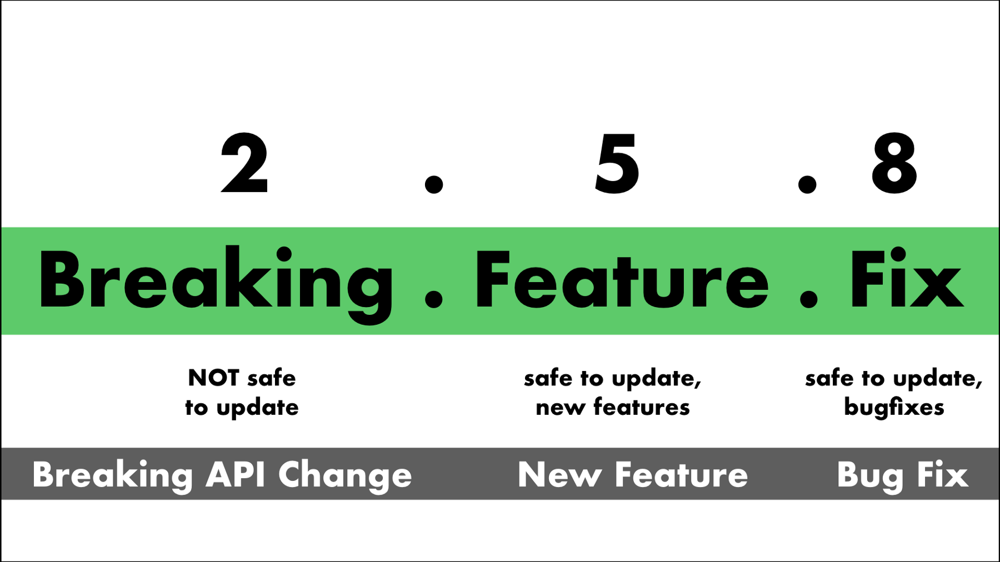
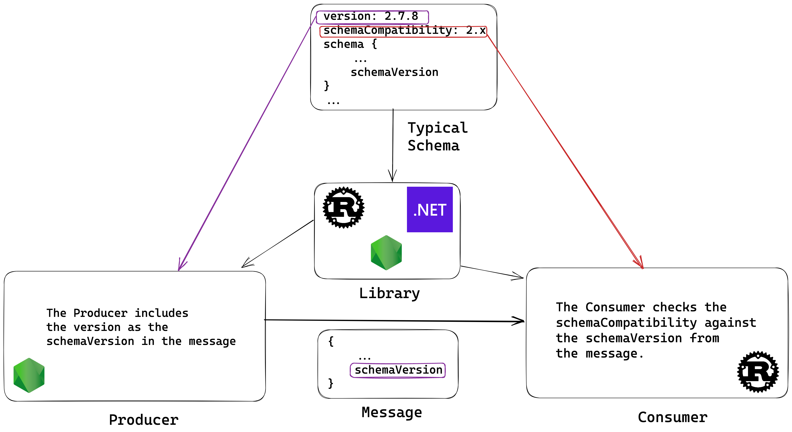

# POC JSON Schemas and Semantic Versioning 

**Discover the Power of JSON Schemas and Semantic Versioning: Unveiling the Potential of IoT and Event-Driven Architectures**

I am proposing a Proof of Concept (POC) to demonstrate the potential of combining JSON Schemas and Semantic Versioning (Semver) for Internet of Things (IoT) and Event-driven architectures. Through this POC, we will be able to demonstrate how these two technologies can be used together to create powerful, versatile, and resilient systems.

## 📺 Video explanation

[10m video in Youtube about this project](https://youtu.be/-C7G41L_uQ8)

## Intro

### Semantic Versioning (Semver)


_Image from [The Neighbourhoodie Software GmbH](https://neighbourhood.ie/blog/2019/04/30/introduction-to-semver/)_

> In the world of software management there exists a dreaded place called “dependency hell.” The bigger your system grows and the more packages you integrate into your software, the more likely you are to find yourself, one day, in this pit of despair.

> In systems with many dependencies, releasing new package versions can quickly become a nightmare. If the dependency specifications are too tight, you are in danger of version lock (the inability to upgrade a package without having to release new versions of every dependent package). If dependencies are specified too loosely, you will inevitably be bitten by version promiscuity (assuming compatibility with more future versions than is reasonable). Dependency hell is where you are when version lock and/or version promiscuity prevent you from easily and safely moving your project forward.

> As a solution to this problem, we propose a simple set of rules and requirements that dictate how version numbers are assigned and incremented. These rules are based on but not necessarily limited to pre-existing widespread common practices in use in both closed and open-source software. For this system to work, you first need to declare a public API. This may consist of documentation or be enforced by the code itself. Regardless, it is important that this API be clear and precise. Once you identify your public API, you communicate changes to it with specific increments to your version number. Consider a version format of X.Y.Z (Major.Minor.Patch). Bug fixes not affecting the API increment the patch version, backwards compatible API additions/changes increment the minor version, and backwards incompatible API changes increment the major version.

> We call this system “Semantic Versioning.” Under this scheme, version numbers and the way they change convey meaning about the underlying code and what has been modified from one version to the next.

- [Website](https://semver.org/)

### Json Schemas

> JSON Schema is a declarative language that allows you to annotate and validate JSON documents.

> JSON Schema enables the confident and reliable use of the JSON data format.

- [Website](https://json-schema.org/)

## What is special in this POC?

You can quickly and effortlessly fork this repository and transform it into a library. Additionally, you can build your own schemas and extend the tests. This is a great opportunity to take full advantage of the features available and develop something unique and powerful.

### Overview




### Contract structure with Semver

Here is a [simple model](src/schemas/user/deleted.json)

```json
{
    "version": "1.0.0",
    "schemaCompatibility": "1.x",
    "name": "userDeleted",
    "schema": {
      "title": "userDeleted",
      "type": "object",
      "properties": {
        "id": {
          "description": "Unique Id for the user",
          "type": "string",
          "format": "uuid"
        },
        "schemaVersion": {
          "description": "Metadata field to determine the json schema version used in the message",
          "type": "string",
          "minLength": 5,
          "maxLength": 14,
          "pattern": "^(?:0|[1-9]\\d*)\\.(?:0|[1-9]\\d*)\\.(?:0|[1-9]\\d*)$"
        },
        "timestamp": {
          "description": "Metadata field to determine the date of the message",
          "type": "integer",
          "minimum": 0
        }
      },
      "additionalProperties": false,
      "required": [
        "id",
        "schemaVersion",
        "timestamp"
      ]
    }
  }
```

**Key ideas**

- Property `version` defines the current contract version.
- Property `schemaCompatibility` defines the compatibility that this contract provides with the messages that arrives
- Property `schema` is actually the model or contract details, for example here we include `id` but can be much reacher, like in [this other sample](src/schemas/user/created.json)
- Property `schema` also include the property `schemaVersion` that defines which contract version has been used to create the message.

### Testing

There are some [general tests](__tests__/general.test.js) that ensures that each contract has valid `schemaCompatibility`, `name` and `version`.

Some [specific tests](__tests__/schemas/user.test.js) that you can use to test the schemas against [fixtures](__fixtures__/index.js) simulating real messages.

Note: It is my personal preference to use the `toMatchSnapshot` functions when testing for shape changes in JSON files and library exports. This means that I have to review the tests every time I make a change in the *.json files, but this is entirely my own decision.

### Extensibility

Even though this Proof-of-Concept is built on Node.js, you can easily transfer [the core](src/index.js) to any computer language (e.g. Python, Rust, Golang) or platform (e.g. HTTP Rest API) so that other IOT devices or microservices, regardless of their language, can benefit from the same library.


### Releasing

The main repository can easily adhere to the principles of Semantic Versioning, since only [the core](src/index.js) and export-specific components are subject to its conventions. All changes to the schemas are treated independently, with each employing Semantic Versioning in its entirety.

### Usage

If you turn this poc into a library you can import it and use to shape the messages that you send/publish and receive/subscribe.

The message that we want to send is related to delete and user:

```json
{
  "id": "4586235c-9800-11ed-a8fc-0242ac120002",
  "timestamp": 163533981300,
  "schemaVersion": "1.0.0"
}
```

As Publisher I will use the library to attach the `schemaVersion` to the message by using the schema `version` available.

```js
const jsonSchemasLibrary = require('@acme/my-great-schemas-library')

// ... your business logic

sendMessage ({
    id: clientId,
    timestamp: Date.now(),
    schemaVersion: jsonSchemasLibrary.user.deleted.version
})
```

Additional type: As a publisher even you can use the schema to check the message before send it.

As consumer you check that the incoming message has an `schemaVersion` version compatible with you, as well you can use any json schema validation library to ensure that the message is following the expected schema

```js
const jsonSchemasLibrary = require('@acme/my-great-schemas-library')
const semver = require('semver')

const Ajv = require('ajv')
const addFormats = require('ajv-formats')
const ajv = new Ajv()
addFormats(ajv)

const { schemaCompatibility, schema } = jsonSchemasLibrary.user.deleted
const validate = ajv.compile(schema)

// Your business logic
const digestMessage = message => {
    const { schemaVersion } = message

    // Check versions
    if(!semver.valid(schemaVersion) || !semver.satisfies(schemaVersion, schemaCompatibility)){
        throw new Error(`Incompatible message version (${schemaVersion}) with Service (${schemaCompatibility})`)
    }

    // Check message integrity based on the schema
    const valid = validate(message)
    if(!valid || validate.errors){
        throw new Error('Invalid message')
    }

    //... Your business logic

}
```

